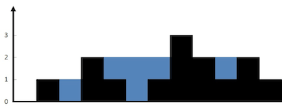

# 参考题目

[42. 接雨水](https://leetcode.cn/problems/trapping-rain-water/)

**42. 接雨水 | 力扣 | LeetCode | 🔴**

给定 n 个非负整数表示每个宽度为 1 的柱子的高度图，计算按此排列的柱子，下雨之后能接多少雨水。

### 示例 1：



```
输入：height = [0,1,0,2,1,0,1,3,2,1,2,1]
输出：6
```

解释：上面是由数组 [0,1,0,2,1,0,1,3,2,1,2,1] 表示的高度图，在这种情况下，可以接 6 个单位的雨水（蓝色部分表示雨水）。

### 示例 2：

```
输入：height = [4,2,0,3,2,5]
输出：9
```

### 提示：

- n == height.length
- 1 <= n <= 2 * 10⁴
- 0 <= height[i] <= 10⁵

## 解法

暴力解法 → 备忘录解法 → 双指针解法

### 暴力解法-核心思路

仅仅考虑位置 i 这一个位置能装下多少水？


能装 2 格水，为什么位置 i 最多能盛 2 格水呢？因为，位置 i 能达到的水柱高度和其左边的最高柱子、右边的最高柱子有关，我们分别称这两个柱子高度为 l_max 和 r_max；位置 i 最大的水柱高度就是 min(l_max, r_max)。

也就是对于位置 i，能够装的水为：

```
water[i] = min(
    # 左边最高的柱子
    max(height[0..i]),  
    # 右边最高的柱子
    max(height[i..end]) 
) - height[i]
```

基于此，暴力写法：

```java
class Solution {
    public int trap(int[] height) {
        int n = height.length;
        int res = 0;
        for (int i = 1; i < n - 1; i++) {
            int l_max = 0, r_max = 0;
            // 找右边最高的柱子
            for (int j = i; j < n; j++)
                r_max = Math.max(r_max, height[j]);
            // 找左边最高的柱子
            for (int j = i; j >= 0; j--)
                l_max = Math.max(l_max, height[j]);
            // 如果自己就是最高的话，
            // l_max == r_max == height[i]
            res += Math.min(l_max, r_max) - height[i];
        }
        return res;
    }
}
```

时间复杂度 O(N²)，空间复杂度 O(1)。但是很明显这种计算 r_max 和 l_max 的方式非常笨拙

### 备忘录优化

开两个数组 r_max 和 l_max 充当备忘录，l_max[i] 表示位置 i 左边最高的柱子高度，r_max[i] 表示位置 i 右边最高的柱子高度。预先把这两个数组计算好，避免重复计算：

```java
class Solution {
    public int trap(int[] height) {
        if (height.length == 0) {
            return 0;
        }
        int n = height.length;
        int res = 0;
        // 数组充当备忘录
        int[] l_max = new int[n];
        int[] r_max = new int[n];
        // 初始化 base case
        l_max[0] = height[0];
        r_max[n - 1] = height[n - 1];
        // 从左向右计算 l_max
        for (int i = 1; i < n; i++)
            l_max[i] = Math.max(height[i], l_max[i - 1]);
        // 从右向左计算 r_max
        for (int i = n - 2; i >= 0; i--)
            r_max[i] = Math.max(height[i], r_max[i + 1]);
        // 计算答案
        for (int i = 1; i < n - 1; i++)
            res += Math.min(l_max[i], r_max[i]) - height[i];
        return res;
    }
}
```

把时间复杂度降低为 O(N)，已经是最优了，但是空间复杂度是 O(N)

### 双指针解法

用双指针边走边算，节省下空间复杂度。

```java
class Solution {
    public int trap(int[] height) {
        int left = 0, right = height.length - 1;
        int l_max = 0, r_max = 0;

        int res = 0;
        while (left < right) {
            l_max = Math.max(l_max, height[left]);
            r_max = Math.max(r_max, height[right]);

            // res += min(l_max, r_max) - height[i]
            if (l_max < r_max) {
                res += l_max - height[left];
                left++;
            } else {
                res += r_max - height[right];
                right--;
            }
        }
        return res;
    }
}
```

对于下图的情况，我们已经知道 l_max < r_max 了，至于这个 r_max 是不是右边最大的，不重要。重要的是 height[i] 能够装的水只和较低的 l_max 之差有关，所以此处自然计算的是 left 柱所能接收雨水：


# 拓展题目

[11. 盛最多水的容器](https://leetcode.cn/problems/container-with-most-water/)

**11. 盛最多水的容器 | 力扣 | LeetCode | 🟠**

给定一个长度为 n 的整数数组 height 。有 n 条垂线，第 i 条线的两个端点是 (i, 0) 和 (i, height[i]) 。

找出其中的两条线，使得它们与 x 轴共同构成的容器可以容纳最多的水。

返回容器可以储存的最大水量。

说明：你不能倾斜容器。

### 示例 1：

```
输入：[1,8,6,2,5,4,8,3,7]
输出：49
```

解释：图中垂直线代表输入数组 [1,8,6,2,5,4,8,3,7]。在此情况下，容器能够容纳水（表示为蓝色部分）的最大值为 49。

### 示例 2：

```
输入：height = [1,1]
输出：1
```

### 提示：

- n == height.length
- 2 <= n <= 10⁵
- 0 <= height[i] <= 10⁴

题目来源：力扣 11. 盛最多水的容器。

## 思路

和接雨水问题很类似，可以完全套用前文的思路，而且还更简单。两道题的区别在于：

接雨水问题给出的类似一幅直方图，每个横坐标都有宽度，而本题给出的每个横坐标是一条竖线，没有宽度。

前文讨论了半天 l_max 和 r_max，实际上都是为了计算 height[i] 能够装多少水；而本题中 height[i] 没有了宽度，那自然就好办多了。

举个例子，如果在接雨水问题中，你知道了 height[left] 和 height[right] 的高度，你能算出 left 和 right 之间能够盛下多少水吗？

不能，因为你不知道 left 和 right 之间每个柱子具体能盛多少水，你得通过每个柱子的 l_max 和 r_max 来计算才行。

反过来，就本题而言，你知道了 height[left] 和 height[right] 的高度，能算出 left 和 right 之间能够盛下多少水吗？

可以，因为本题中竖线没有宽度，所以 left 和 right 之间能够盛的水就是：

```
min(height[left], height[right]) * (right - left)
```

解决这道题的思路依然是双指针技巧：

### 双指针

用 left 和 right 两个指针从两端向中心收缩，一边收缩一边计算 [left, right] 之间的矩形面积，取最大的面积值即是答案。

注意，收缩的操作本就是为了寻找更大的面积，所以应该把 left 和 right 更小的一边先进行收缩，期望能够找到更高的边代替，进而能够更新最大面积

```java
class Solution {
    public int maxArea(int[] height) {
        int left = 0, right = height.length - 1;
        int res = 0;
        while (left < right) {
            // [left, right] 之间的矩形面积
            int cur_area = Math.min(height[left], height[right]) * (right - left);
            res = Math.max(res, cur_area);
            // 双指针技巧，移动较低的一边
            if (height[left] < height[right]) {
                left++;
            } else {
                right--;
            }
        }
        return res;
    }
}
```