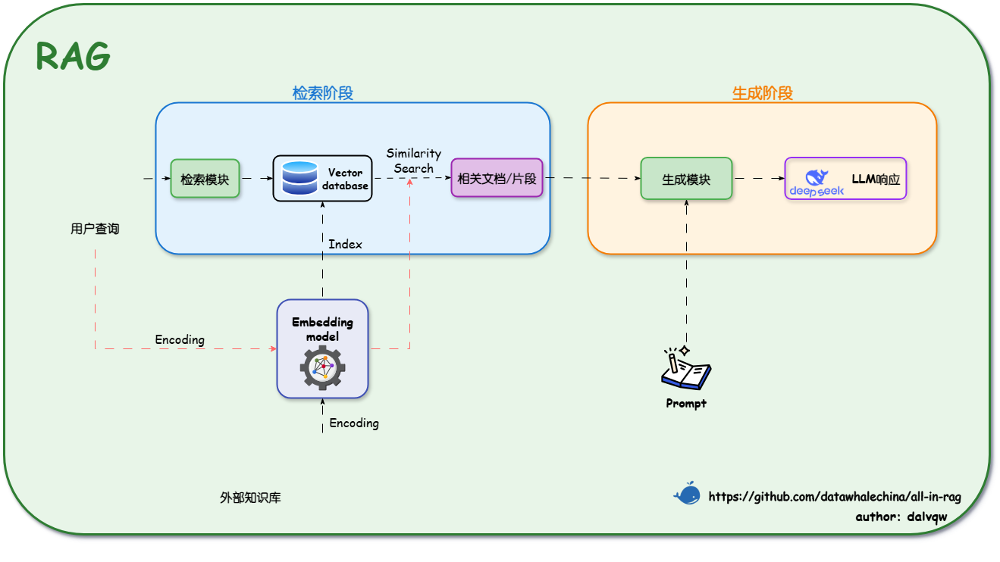
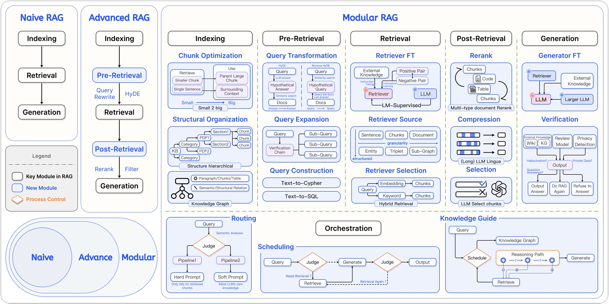
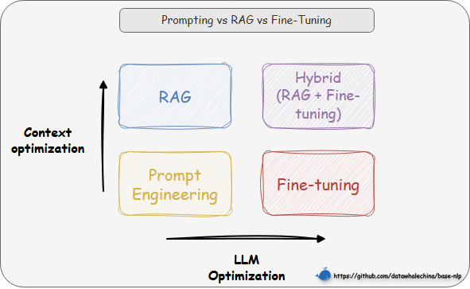

# 一、什么是RAG？

## 1.1 核心定义

从本质上讲，RAG（Retrieval-Augmented Generation）是一种旨在解决大语言模型（LLM）“知其然不知其所以然”问题的技术范式。它的核心是将模型训练过程学到的“参数化知识”（模型权重中固化的、模糊的“记忆”），与来自外部知识库的“非参数化知识”（精准、可随时更新的外部数据）相结合。其运作逻辑就是在 LLM 正式推理前，先通过检索机制从外部知识库中检索相关信息，并将这些“参考资料”融入推理过程，从而提升输出的准确性和时效性。

## 1.2 技术原理

RAG 系统是如何实现“参数化知识”与“非参数化知识”的结合呢？其架构主要通过两个阶段来完成这一过程：
1. 检索阶段：寻找“非参数化知识”
    - 知识向量化：嵌入模型（Embedding Model） 充当了“转换器”的角色。它将外部知识库编码为高维向量索引（Index），存入向量数据库。
    - 语义召回：当用户发起查询时，检索模块利用同样的嵌入模型将问题向量化，并通过相似度搜索（Similarity Search），从海量数据中精准锁定与问题最相关的文档片段。
2. 生成阶段：融合两种知识
    - 上下文整合：生成模块接收检索阶段送来的相关文档片段以及用户的原始问题。
    - 指令引导生成：该模块会遵循预设的 Prompt 指令，将上下文与问题有效整合，并引导 LLM（如 DeepSeek）进行可控的、有理有据的文本生成。
    

## 1.3 技术演进分类

RAG 技术架构经历了从简单到复杂的演进，如下图大致可以分为三个阶段

这三个阶段的具体对比如表 1-1 所示。

<table border="1" style="margin: 0 auto;">
  <tr>
    <th style="text-align: center;"></th>
    <th style="text-align: center;">初级 RAG（Naive RAG）</th>
    <th style="text-align: center;">高级 RAG（Advanced RAG）</th>
    <th style="text-align: center;">模块化 RAG（Modular RAG）</th>
  </tr>
  <tr>
    <td style="text-align: center;"><strong>流程</strong></td>
    <td style="text-align: center;"><strong>离线:</strong> <code>索引</code> <strong>在线:</strong> <code>检索 → 生成</code></td>
    <td style="text-align: center;"><strong>离线:</strong> <code>索引</code> <strong>在线:</strong> <code>...→ 检索前 → ... → 检索后 → ...</code></td>
    <td style="text-align: center;">积木式可编排流程</td>
  </tr>
  <tr>
    <td style="text-align: center;"><strong>特点</strong></td>
    <td style="text-align: center;">基础线性流程</td>
    <td style="text-align: center;">增加<strong>检索前后</strong>的优化步骤</td>
    <td style="text-align: center;">模块化、可组合、可动态调整</td>
  </tr>
  <tr>
    <td style="text-align: center;"><strong>关键技术</strong></td>
    <td style="text-align: center;">基础向量检索</td>
    <td style="text-align: center;"><strong>查询重写（Query Rewrite）</strong> <strong>结果重排（Rerank）</strong></td>
    <td style="text-align: center;"><strong>动态路由（Routing）</strong> <strong>查询转换（Query Transformation）</strong> <strong>多路融合（Fusion）</strong></td>
  </tr>
  <tr>
    <td style="text-align: center;"><strong>局限性</strong></td>
    <td style="text-align: center;">效果不稳定，难以优化</td>
    <td style="text-align: center;">流程相对固定，优化点有限</td>
    <td style="text-align: center;">系统复杂性高</td>
  </tr>
</table>

<em>表 1-1 RAG 技术演进分类对比</em>

> “离线”指提前完成的数据预处理工作（如索引构建）；“在线”指用户发起请求后的实时处理流程。

# 二、为什么要用 RAG？

## 2.1 技术选型路径

在进行具体的技术选型，需要重点考虑**成本与效益的平衡**。通常，我们应优先选择对模型改动最小、成本最低的方案，所以技术选型路径往往遵循的顺序是**提示词工程（Prompt Engineering） -> 检索增强生成 -> 微调（Fine-tuning）**。

从两个维度来理解这些技术的区别：
1. **横轴代表“LLM 优化”**，即对模型本身进行多大程度的修改。从左到右，优化的程度越来越深，其中提示工程和 RAG 完全不改变模型权重，而微调则直接修改模型参数。
2. **纵轴代表“上下文优化”**，是对输入给模型的信息进行多大程度的增强。从下到上，增强的程度越来越高，其中提示工程只是优化提问方式，而 RAG 则通过引入外部知识库，极大地丰富了上下文信息。

基于此，我们的选择路径就清晰了：
1. 先尝试提示工程：通过精心设计提示词来引导模型，适用于任务简单、模型已有相关知识的场景。
2. 再选择 RAG：如果模型缺乏特定或实时知识而无法回答，则使用 RAG，通过外挂知识库为其提供上下文信息。
3. 最后考虑微调：当目标是改变模型“如何做”（行为/风格/格式）而不是“知道什么”（知识）时，微调是最终且最合适的选择。例如，让模型学会严格遵循某种独特的输出格式、模仿特定人物的对话风格，或者将极其复杂的指令“蒸馏”进模型权重中。

RAG 的出现填补了通用模型与专业领域之间的鸿沟，在解决如表 1-2 所示 LLM 局限时尤其有效：

<table border="1" style="margin: 0 auto;">
  <tr>
    <th style="text-align: center;">问题</th>
    <th style="text-align: center;">RAG的解决方案</th>
  </tr>
  <tr>
    <td style="text-align: center;"><strong>静态知识局限</strong></td>
    <td style="text-align: center;">实时检索外部知识库，支持动态更新</td>
  </tr>
  <tr>
    <td style="text-align: center;"><strong>幻觉（Hallucination）</strong></td>
    <td style="text-align: center;">基于检索内容生成，错误率降低</td>
  </tr>
  <tr>
    <td style="text-align: center;"><strong>领域专业性不足</strong></td>
    <td style="text-align: center;">引入领域特定知识库（如医疗/法律）</td>
  </tr>
  <tr>
    <td style="text-align: center;"><strong>数据隐私风险</strong></td>
    <td style="text-align: center;">本地化部署知识库，避免敏感数据泄露</td>
  </tr>
</table>

<em>表 1-2 RAG 对 LLM 局限的解决方案</em>

## 2.2 关键优势 

1. **准确性与可信度的双重提升**：RAG 最核心的价值在于突破了模型预训练知识的限制。它不仅能**补充专业领域的知识盲区**，还能通过提供具体的参考材料，有效**抑制“一本正经胡说八道”的幻觉现象**。论文研究还表明，RAG 生成的内容在**具体性**和**多样性**上也显著优于纯 LLM。更重要的是，RAG 具备**可溯源性**——每一条回答都能找到对应的原始文档出处，这种“有据可查”的特性极大提高了内容在法律、医疗等严肃场景下的可信度。

2. **时效性保障**：在知识更新方面，RAG 解决了 LLM 固有的**知识时滞问题**（即模型不知道训练截止日期之后发生的事）。RAG 允许知识库独立于模型进行**动态更新**——新政策或新数据一旦入库，立刻就能被检索到。这种能力在论文中被称为**“索引热拔插”（Index Hot-swapping）**——就像给机器人换一张存储卡一样，瞬间切换其世界知识库，而无需重新训练模型，实现了知识的实时在线。

3. **显著的综合成本效益**：从经济角度看，RAG 是一种高性价比的方案。首先，它**避免了高频微调**带来的巨额算力成本；其次，由于有了外部知识的强力辅助，我们在处理特定领域问题时，往往可以使用**参数量更小的基础模型**来达到类似的效果，从而直接降低了推理成本。这种架构也减少了试图将海量知识强行“塞入”模型权重中所需的计算资源消耗。

4. **灵活的模块化可扩展性**：RAG 的架构具备极强的包容性，支持**多源集成**，无论是 PDF、Word 还是网页数据，都能统一构建进知识库中。同时，其**模块化设计**实现了检索与生成的解耦，这意味着我们可以独立优化检索组件（比如更换更好的 Embedding 模型），而不会影响到生成组件的稳定性，便于系统的长期迭代。
